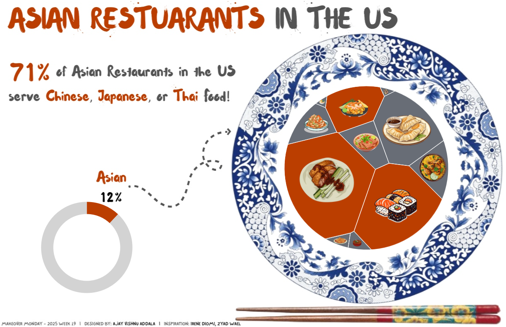

# Asian Restaurants in the U.S. Visualization Project

## Overview
This repository contains the Tableau visualization project for this week's Makeover Monday challenge. The project explores the distribution of Asian restaurants in the United States, focusing on the cuisines they serve, such as Chinese, Japanese, Thai, and others. The primary visualization is a **Voronoi chart** styled as a **serving plate** that depicts the percentage share of each cuisine.

## Visualization Details
- **Data Source:** Pew Research Center analysis based on SafeGraph data
- **Key Metrics:**
  - Percentage of Asian restaurants serving different cuisines
  - Geographic concentration of Asian restaurants
- **Design:** Voronoi chart placed on a serving plate to represent cuisine proportions visually

## Snapshot

## Tableau Public Link
You can interact with the visualization on Tableau Public: [Asian Restaurants in the U.S.](https://public.tableau.com/views/AsianRestaurantsintheUSMOM2025W19/MOM2025W19?:language=en-US&:sid=&:redirect=auth&:display_count=n&:origin=viz_share_link)

## Project Files
- `asian_restaurants.twbx`: Tableau workbook file containing the project.
- `data/`: Folder containing the raw and processed data files.
- `images/`: Folder containing snapshots and assets used in the README.
- `README.md`: This file.

## Key Insights
- **Cuisine Distribution:** 71% of Asian restaurants serve Chinese, Japanese, or Thai food.
- **Chinese Dominance:** 39% of all Asian restaurants serve Chinese food.
- **Geographic Concentration:** Nearly half of Asian restaurants are in five states: California, New York, Texas, New Jersey, and Washington.
- **Underserved Cuisines:** Indian and Filipino restaurants are underrepresented despite significant populations.

